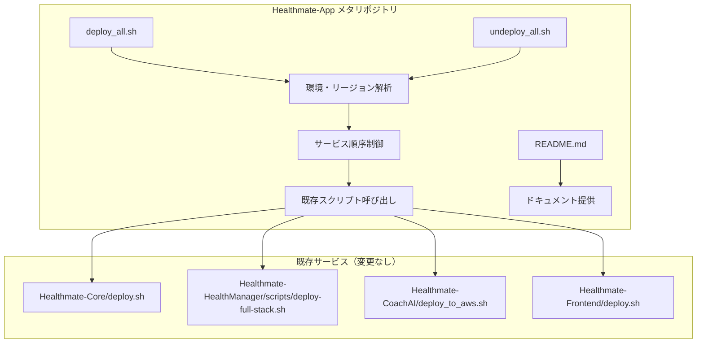
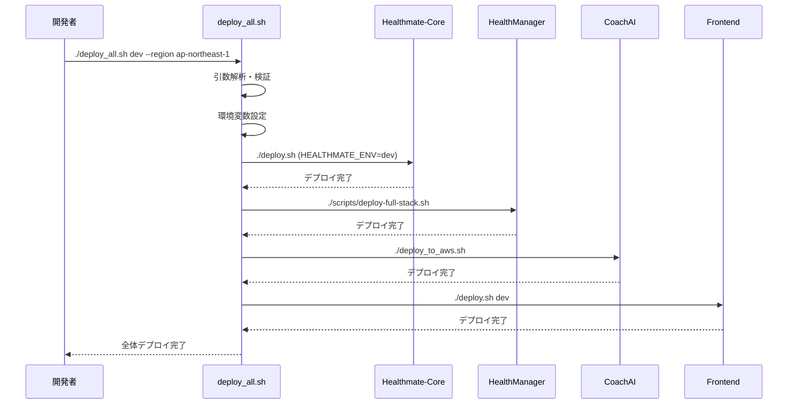

# 設計書

## 概要

Healthmate-App統合デプロイメント管理システムは、4つの独立したHealthmateサービス（Core、HealthManager、CoachAI、Frontend）を一括で管理するメタリポジトリです。既存サービスのコードを一切変更せず、各サービスの既存デプロイスクリプトを呼び出すラッパー機能として実装します。

## アーキテクチャ

### システム構成図



### デプロイフロー



## コンポーネントと インターフェース

### 1. deploy_all.sh（一括デプロイスクリプト）

**責任**: 4つのサービスを正しい順序で一括デプロイ

**インターフェース**:
```bash
./deploy_all.sh [environment] [--region region-name]
```

**パラメータ**:
- `environment`: dev/stage/prod（省略時はdev）
- `--region`: AWSリージョン（省略時はAWS CLIデフォルト）

**内部処理**:
1. 引数解析と検証
2. 環境変数設定（HEALTHMATE_ENV、AWS_REGION）
3. サービス順序制御（Core→HealthManager→CoachAI→Frontend）
4. 各サービスの既存デプロイスクリプト呼び出し
5. エラーハンドリングと進行状況表示

### 2. undeploy_all.sh（一括アンデプロイスクリプト）

**責任**: 4つのサービスを逆順で一括アンデプロイ

**インターフェース**:
```bash
./undeploy_all.sh [environment] [--region region-name]
```

**内部処理**:
1. 引数解析と検証
2. 環境変数設定
3. 逆順サービス制御（Frontend→CoachAI→HealthManager→Core）
4. 各サービスの既存アンデプロイスクリプト呼び出し
5. エラー時も継続実行（警告表示）

### 3. README.md（ドキュメント）

**責任**: 全体設計の説明とリンク集提供

**内容**:
- Healthmate-App全体設計図
- 4つのサービスへのリンク集
- デプロイ順序と依存関係説明
- 使用例とコマンド説明
- 環境変数とリージョン設定説明

## データモデル

### 環境設定モデル

```typescript
interface DeploymentConfig {
  environment: 'dev' | 'stage' | 'prod';
  region: string;
  services: ServiceConfig[];
}

interface ServiceConfig {
  name: string;
  path: string;
  deployScript: string;
  undeployScript: string;
  environmentVariable: string;
}
```

### サービス定義

```bash
# サービス設定配列
SERVICES=(
  "Core:../Healthmate-Core:deploy.sh:destroy.sh:HEALTHMATE_ENV"
  "HealthManager:../Healthmate-HealthManager:scripts/deploy-full-stack.sh:scripts/destroy-full-stack.sh:HEALTHMATE_ENV"
  "CoachAI:../Healthmate-CoachAI:deploy_to_aws.sh:destroy_from_aws.sh:HEALTHMATE_ENV"
  "Frontend:../Healthmate-Frontend:deploy.sh:scripts/destroy.sh:HEALTHMATE_ENV"
)
```

## 正確性プロパティ

*プロパティとは、システムのすべての有効な実行において真であるべき特性や動作のことです。これらは人間が読める仕様と機械で検証可能な正確性保証の橋渡しをします。*

### プロパティ1: デプロイ順序の保証

*すべての*デプロイ実行において、サービスは必ずCore→HealthManager→CoachAI→Frontendの順序でデプロイされる
**検証: 要件5.1**

### プロパティ2: アンデプロイ順序の保証

*すべての*アンデプロイ実行において、サービスは必ずFrontend→CoachAI→HealthManager→Coreの順序でアンデプロイされる
**検証: 要件5.2**

### プロパティ3: 環境・リージョン設定の一貫性

*すべての*サービスに対して、同じ環境パラメータ（dev/stage/prod）とリージョン設定が渡される
**検証: 要件1.1, 1.2, 2.1, 2.2, 6.1, 6.2**

### プロパティ4: デプロイエラー時の停止保証

*すべての*デプロイ実行において、前のサービスのデプロイが失敗した場合、後続のサービスのデプロイは実行されない
**検証: 要件3.2, 5.3**

### プロパティ5: アンデプロイエラー時の継続保証

*すべての*アンデプロイ実行において、一つのサービスのアンデプロイが失敗しても、他のサービスのアンデプロイは継続される
**検証: 要件3.4**

### プロパティ6: ログ出力の保証

*すべての*スクリプト実行において、各サービスの開始・完了・エラー状況がログ出力される
**検証: 要件3.1, 3.3, 3.5**

### プロパティ7: デフォルト値の保証

*すべての*引数未指定実行において、環境はdev、リージョンはAWS CLIデフォルトまたは環境変数AWS_REGIONが使用される
**検証: 要件1.4, 1.5, 2.4, 2.5, 6.5**

### プロパティ8: 入力検証の保証

*すべての*無効な環境名またはリージョン名に対して、適切なエラーメッセージと有効な選択肢が表示される
**検証: 要件6.3, 6.4**

### プロパティ9: サービス間同期の保証

*すべての*デプロイ実行において、各サービスのデプロイ完了を確認してから次のサービスのデプロイが開始される
**検証: 要件5.4**

## エラーハンドリング

### デプロイ時エラー処理

1. **引数検証エラー**: 無効な環境名・リージョン名の場合、エラーメッセージと有効な選択肢を表示
2. **サービスデプロイエラー**: 前のサービスが失敗した場合、後続サービスを実行せず全体を停止
3. **スクリプト不存在エラー**: 呼び出し対象スクリプトが存在しない場合、明確なエラーメッセージを表示
4. **権限エラー**: AWS認証情報が無効な場合、設定方法を案内

### アンデプロイ時エラー処理

1. **継続実行**: 一つのサービスのアンデプロイが失敗しても、他のサービスのアンデプロイは継続
2. **警告表示**: 失敗したサービスについて警告メッセージを表示
3. **最終サマリー**: 全体の実行結果（成功・失敗・警告）をサマリー表示

## テスト戦略

### 単体テスト

**対象**: 個別機能の検証
- 引数解析ロジック
- 環境変数設定ロジック
- サービス順序制御ロジック
- エラーメッセージ生成

**実装方法**: Bashスクリプトテストフレームワーク（bats-core）を使用

### プロパティベーステスト

**対象**: 正確性プロパティの検証
- **プロパティ1**: ランダムな実行条件でデプロイ順序を検証
- **プロパティ2**: ランダムな実行条件でアンデプロイ順序を検証
- **プロパティ3**: ランダムな環境・リージョン設定で一貫性を検証
- **プロパティ4**: ランダムなエラー条件で停止動作を検証
- **プロパティ5**: ランダムなサービス組み合わせでスクリプト呼び出しを検証
- **プロパティ6**: ランダムな無効入力で引数検証を検証

**設定**: 各プロパティテストは最低100回の反復実行
**タグ形式**: **Feature: unified-deployment-management, Property {number}: {property_text}**

### 統合テスト

**対象**: 実際のAWS環境での動作検証
- dev環境での完全デプロイ・アンデプロイサイクル
- 異なるリージョンでのデプロイ検証
- エラー条件での動作確認

## 実装詳細

### ディレクトリ構造

```
Healthmate-App/
├── README.md                    # 全体設計とリンク集
├── deploy_all.sh               # 一括デプロイスクリプト
├── undeploy_all.sh             # 一括アンデプロイスクリプト
├── .kiro/
│   └── specs/
│       └── unified-deployment-management/
│           ├── requirements.md  # この要件書
│           ├── design.md       # この設計書
│           └── tasks.md        # 実装タスク（後で作成）
└── tests/                      # テストスイート（実装時に作成）
    ├── unit/                   # 単体テスト
    ├── property/               # プロパティベーステスト
    └── integration/            # 統合テスト
```

### 環境変数マッピング

| サービス | 環境変数 | 設定方法 |
|---------|---------|---------|
| Core | HEALTHMATE_ENV | export設定 |
| HealthManager | HEALTHMATE_ENV | export設定 |
| CoachAI | HEALTHMATE_ENV | export設定 |
| Frontend | 引数渡し | deploy.sh dev |

### スクリプト呼び出しパターン

```bash
# Core
cd ../Healthmate-Core
export HEALTHMATE_ENV=$ENVIRONMENT
export AWS_REGION=$REGION
./deploy.sh

# HealthManager
cd ../Healthmate-HealthManager
export HEALTHMATE_ENV=$ENVIRONMENT
export AWS_REGION=$REGION
./scripts/deploy-full-stack.sh

# CoachAI
cd ../Healthmate-CoachAI
export HEALTHMATE_ENV=$ENVIRONMENT
export AWS_REGION=$REGION
./deploy_to_aws.sh

# Frontend
cd ../Healthmate-Frontend
export AWS_REGION=$REGION
./deploy.sh $ENVIRONMENT
```

## セキュリティ考慮事項

1. **認証情報**: AWS認証情報は各サービスの既存メカニズムを使用
2. **権限**: 各サービスが必要とする最小権限のみ使用
3. **ログ**: 機密情報（認証情報等）はログに出力しない
4. **環境分離**: 環境間でのリソース混在を防ぐ厳密な環境管理

## パフォーマンス考慮事項

1. **並列実行**: サービス間に依存関係があるため、順次実行が必要
2. **タイムアウト**: 各サービスのデプロイに適切なタイムアウトを設定
3. **リソース使用量**: 各サービスの既存実装に依存
4. **ネットワーク**: AWSリージョン間の通信遅延を考慮